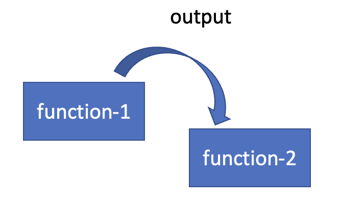

# Functional Programming In Java


# Overview

The Repository is a compendium of Java-based Functional Programming examples aimed at enhancing your comprehension of the concepts and facilitating your eventual implementation of them.
The examples in this repo doesn't contains the examples of how to use obvious map, filter, reduce, instead it focuses on writing efficient functional code. 
Throughout this course, you will gain a solid understanding of Functional programming concepts, starting from the fundamentals and progressing to more advanced topics. You will learn how to write Higher Order Functions in Java and how to leverage Function Chaining to produce elegant and efficient code. 
Additionally, you will explore Function Currying, Partial Functions, and Monads. One noteworthy aspect of this course is that it includes a variety of practical examples, which will be incredibly beneficial for your learning experience.

# What you'll learn and how the code is structured. 

The repository contains examples that demonstrate the principles of writing elegant functional code. The repo so far has 2 packages "basic" and "problems". One should start exploring from the "basic" package that 
has several sub-packages covering each FP concept one should start learning in this order 

basics 
   -- composition
            -- basic
            -- advance 
   -- hof
   -- currying 

###  The "composition.basic" and "composition.advance" packages in Java for Function Chaining

The "composition.basic" package provides a comprehensive guide for chaining regular functions, covering examples for String manipulation, file reading, and handling functions with multiple parameters. Here is the suggested order for learning these examples:

**StringFunctionPipeline**: Creating a pipeline of functions to manipulate strings.

**BiFunctionPipeline**: Chaining BiFunctions and returning Tuples, utilizing the Tuple class.

**TriFunctionPipeline**: Handling functions with three parameters using TriFunction.

**UserManagementService**: Demonstrating function chaining in a Spring Boot application.

### The "composition.advance" package is dedicated to showcasing how to chain objects of the java.util.function.Function interface. 

Here is the suggested order for learning these examples:

**FunctionExample**: Demonstrating Function as First-class citizens in Java.

**StringFunctionPipeline**: Creating a pipeline of Functions to manipulate strings.

**FunctionCompositionExample**: Understanding the difference between 'compose' and 'andThen' functions.

### The "basics.hof" package contains Higher Order Function examples, which are functions that either take other functions as arguments or return functions as results.
Here is the suggested order for learning these examples:

**StringComparatorHof**: Example demonstrates passing Comparator Function to a Function and Compares Strings. 

### The "currying" package is dedicated to showcasing Function Currying and Partial Applied Functions (PAF)

The "functional.currying" package provides examples of Currying, which is a technique for transforming a function that takes multiple arguments into a sequence of functions that each take a single argument.
Here is the suggested order:

**CurriedCreateUser**: Showcases simple example of Function Currying

**CurriedEmailComposer**: Showcases Composing EmailId using Currying

**TriFunctionCurrying**: Slightly advance example of Currying.

**PartialApplicationEndpoint**: Demonstrates example of Partial Applied Function (PAF)

**PartialFunctionApplicationExample**: MOST IMPORTANT EXAMPLE OF CURRYING AND PAF.

### The "types" package contains types. 

There are 2 Types covered Tuple and Unit. 

**Tuple**: In functional programming, a tuple is an ordered collection of elements of different types.

**Unit**: Unit is a class that represents the absence of a value. It is used to indicate that a function returns no useful value, similar to the void type.

### The utils package is work in progress that is a collection of some user-defined utils method. Very USEFUL by the way. 

# What are Functions 

In computer programming, a function is a self-contained block of code that performs a specific task. 
Functions take input, called arguments or parameters, and can return output values, allowing them to be used as building blocks for larger programs.


# Understanding Functions in Functional Programming 

   Functions are a key concept in functional programming, and are used to express computations and transformations on data. In functional programming, functions are treated as first-class citizens, meaning that they can be passed around as values, stored in variables or data structures, and returned as results from other functions.
   Functions in functional programming are typically pure functions, which means that they don't have any side effects, and their output is solely determined by their input. This makes them very predictable and easy to reason about, since their behavior doesn't depend on any external state or context.

   One way to perceive java.util.function.Function is as follows: 

   
   
   BiFunction can be perceive as

   

# Lambda Expression

  In Java, a lambda expression is a type of anonymous function that can be used to represent a block of code that can be passed as an argument to a method or stored in a variable. When a Java compiler encounters a lambda expression in the source code, it performs several steps to detect and process it:
   
   ##### **_Parsing_**: The Java compiler parses the lambda expression to determine its syntax and identify the variables that are used in the expression.
   
   ##### **_Type_ _Inference_**: The compiler infers the types of the lambda parameters based on the context in which the lambda expression is used.
   
   ##### **Creation of a Functional Interface**:_ A lambda expression is only valid if it can be assigned to a functional interface. A functional interface is an interface with a single abstract method. If the lambda expression matches the signature of the functional interface, the compiler creates an instance of that interface and assigns the lambda expression to it.
    
   ##### **Compilation**_: Finally, the compiler compiles the lambda expression and generates bytecode that can be executed by the Java Virtual Machine (JVM).

   During compilation, the lambda expression is translated into a class file that implements the functional interface. The class file contains a method that implements the lambda expression, as well as any captured variables and their values. When the lambda expression is executed, the JVM creates an instance of this class and invokes the method on that instance.

# How Lambda Expressions handled by JVM  

When a lambda expression is encountered in Java code, the JVM uses the invokedynamic instruction to create an instance of a functional interface that represents the lambda.

Here's how the process works in more detail:

1. The Java compiler generates an instance of a functional interface that corresponds to the lambda expression. For example, if the lambda expression is of the form x -> x * 2, the compiler generates an instance of the java.util.function.IntUnaryOperator interface.

2. The invokedynamic instruction is used to create a CallSite object, which is responsible for the dynamic invocation of the lambda expression. The CallSite object is associated with the lambda expression and the functional interface instance generated in step 1.

3. When the lambda expression is invoked, the JVM uses the CallSite object to dynamically bind the lambda expression to the appropriate method in the functional interface.

4. The JVM then invokes the method on the functional interface instance using the appropriate arguments, and returns the result to the calling code.

Overall, the use of invokedynamic and functional interfaces enables efficient implementation of lambda expressions in Java, allowing for concise and expressive code. The dynamic binding of the lambda expression to the appropriate method in the functional interface allows for greater flexibility in code composition and enables more powerful abstractions in Java programming.

# Function Chaining

In order to create a chain of functions, it is essential to first instantiate a Function or BiFunction object.
This marks the beginning of the pipeline. For example, you could create a Function<String, String> object named "pipeline" using the
"createReader" method of the "FileOps" class. Once you have created the "pipeline" object, you can use the "andThen" method to chain subsequent functions together.
Each function in the chain will take the output of the preceding function as input. Eventually, the final function in the chain should return a String value.

Function<String, String> pipeline = FileOps :: createReader;

pipeline.andThen("Output of Create Reader is input here") and so on, but eventually it should return String.

more details can be found here: https://www.c-sharpcorner.com/article/creating-function-pipelines-in-java/

# Function Chaining Use Cases

**Data processing**: Function chaining can be used to perform a series of data transformations on a collection or stream of data, such as filtering, mapping, sorting, and reducing. By chaining these operations together, you can create a data processing pipeline that is both efficient and easy to read and maintain.

**Input validation**: Function chaining can be used to validate user input by applying a series of validation rules to the input data. Each function in the chain can check a specific aspect of the input, such as its length, format, or range, and return an error message if the input fails the validation.

**Logging and debugging**: Function chaining can be used to create a chain of logging or debugging statements that track the execution of a program or a specific code path. Each function in the chain can output a specific piece of information, such as the input or output data, the execution time, or the error message, and pass the output to the next function in the chain.

**Configuration and setup**: Function chaining can be used to configure and set up a complex system or application. Each function in the chain can perform a specific configuration task, such as initializing a database connection, setting up a network connection, or loading a configuration file, and pass the configuration data to the next function in the chain.

In general, function chaining can be used in any situation where you need to compose a series of related functions to perform a specific task or data transformation. By chaining the functions together, you can create a powerful and flexible pipeline that is both easy to use and easy to maintain.

# Function Chaining Methods and Interfaces

**apply Function**: The 'apply()' method takes an input and returns a result. It is used to apply a function to an argument and compute a result

   ```
   Function<Integer, Integer> doubleFunction = x -> x * 2;
   Integer result = doubleFunction.apply(5); // result is 10
   ```
In this example, we have created a function that doubles its input and applied it to the integer 5. The apply() method takes the integer 5 as an argument and returns the result 10.
Remember: apply returns a result

**andThen Function:** The Function interface's "andThen" method takes a sequence of two functions and applies them in succession, using the output of the first function as the input to the second function. This chaining of the functions results in a new function that combines the behavior of both functions in a single transformation. Here's an example:



    ```
      Function<Integer, Integer> addOne = x -> x + 1;
      Function<Integer, Integer> doubleIt = x -> x * 2;
      Function<Integer, Integer> addOneAndDoubleIt = addOne.andThen(doubleIt);
   
      System.out.println(addOneAndDoubleIt.apply(5)); // Output: 12
   
    ```


**compose Function:** In contrast to the "andThen" method, the "compose" method applies the first function to the output of the second function. This means that the second function is applied to the input, and then the first function is applied to the output of the second function. This results in a chain of functions where the output of the second function becomes the input of the first function.. Here's an example:


       ```
         Function<Integer, Integer> addOne = x -> x + 1;
         Function<Integer, Integer> doubleIt = x -> x * 2;
         Function<Integer, Integer> addOneAfterDoubleIt = addOne.compose(doubleIt);
      
         System.out.println(addOneAfterDoubleIt.apply(5)); // Output: 11
      
       ```

**BiFunction Interface:** BiFunction can be represented as Function<A, Function<A, B>>

      ```
      /**
      * Input is Function<String, Function<String,String>>
      *     Input to Function is String and output is a second function
      *       Input to second function is String and output is a String, hence on apply.apply a String is returned
      *        Input to first function (s1) output is a function (s2) -> s1 + s2
      *          Input to second function is (s2) output is s1 + s2
      *
      */
      (s1) -> (s2) -> s1 + s2
      private static String function(Function<String, Function<String, String>> f){
         return f.apply("Hello").apply("World");
      }
      
      (s1, s2) -> s1 + s2 
      private static String biFunc(BiFunction<String, String, String> b){
        return b.apply("Hello", "World");
     }
      ```

**TriFunction:** If we require more than two parameters to be passed to a function, such as three parameters, we may encounter a problem as there is no TriFunction interface available in Java. However, there are two potential solutions to this issue.
The first is to create our own TriFunction interface, which would resemble something like:,

      ```
      @FunctionalInterface
      public interface TriFunction<A, B, C, R> {
           R apply(A a, B b, C c);

           default <R> TriFunction<A, B, C, R> andThen(TriFunction<A, B, C, R> after) {
              return (A a, B b, C c) -> after.apply(a,b,c);
            }
      }
     ```
If we need to pass more than three parameters to a function, it can become a difficult problem to solve. In such cases, using currying can be the most effective approach.
By breaking down the function into a series of nested functions, each taking one argument, we can create a more flexible and reusable solution.

# Higher Order Function 

  A higher-order function is a function that can take one or more functions as arguments, and/or return a function as its result. 
  This allows for more flexible and reusable code, as functions can be passed around like any other value. 
  We are familiar with 'map()', 'filter()' methods both of them take Function and Predicate as arguments 


  They are an important and powerful concept in functional programming, providing several benefits, including:
   
  **Code reuse**: Higher-order functions allow you to abstract away common patterns of code, such as iterating over a collection, filtering elements, or mapping values. Once you have written a higher-order function for a particular pattern, you can reuse it with different functions to achieve different behaviors.
   
  **Code clarity**: Higher-order functions can make code more concise and easier to read by removing unnecessary boilerplate code. By passing a function as an argument to another function, you can define behavior in a clear and declarative way.
   
  **Flexibility**: Higher-order functions allow you to write more flexible code that can adapt to different situations. By allowing functions to be passed as arguments or returned as results, higher-order functions can be used to create generic and reusable code that can be adapted to different contexts.
   
  **Separation of concerns**: Higher-order functions can help to separate concerns by allowing you to define specific behavior in separate functions, which can then be combined and reused as necessary. This can make code more modular and easier to test.
   
  **Function composition and Chaining**: Higher-order functions can be used to compose more complex functions by combining simpler functions in a logical and reusable way. This can make code more expressive and easier to reason about. 
    
####   Example of HOF that takes Function as an argument 
  
   ```
    public static void applyMultiplyFunction(Integer[] numbers, Function<Integer, Integer> f){
        for(int i=0; i < numbers.length; i++){
            numbers[i] = f.apply(numbers[i]);
        }
    }

    public static void main(String[] args) {
        Integer[] numbers = {1,2,3,4,5};
        Function<Integer, Integer> multiply = x -> x * 2;
        applyMultiplyFunction(numbers, multiply);
        System.out.println(Arrays.toString(numbers));
    }
  ```
  In the above example, we have created a Higher Order Function "applyMultiplyFunction" that takes an array of integers and a function as arguments, and applies the function to each element of the array.
  This example demonstrates how higher-order functions can be used to make our code more modular and reusable, by abstracting away the details of how a function is applied to an array or collection.

####   Example of HOF that returns Function as it's result

    ```
       private static Function<String, String> prefix = str -> str;
   
       private static Function<String, String> suffix(String str){
           return suffix -> str + " " + suffix;
       }
   
       public static void main(String[] args) {
           Function<String, Function<String, String>> namePipeline = name -> prefix.andThen(suffix(name));
           System.out.println(namePipeline.apply("John").apply("Doe"));
       }
    ```
The example above includes the creation of two functions, "prefix" and "suffix", both of which return a function that takes a string input and produces a string output. These two functions are then combined together using a pipeline, allowing their outputs to be concatenated.


# Currying and Partial Functions

   Function currying is a technique that involves breaking down a function that takes multiple arguments into a series of functions that each take a single argument.
   In other words, it transforms a function that takes multiple arguments into a chain of functions that each take a single argument and return a new function until all the original arguments are consumed.
   Java's Function interface supports currying through the use of the "andThen" and "compose" methods. These methods enable the creation of a sequence of functions where the output of one function is used as the input of another function. By chaining functions together in this way, it is possible to create a pipeline of transformations that can be applied to data in a flexible and modular way.
   Currying has several benefits, including making it easier to reuse and compose functions, and enabling functions to be partially applied with some of their arguments fixed at runtime. This can lead to more modular, maintainable code and can simplify the development process. However, it's important to use currying judiciously and to avoid creating overly complex function chains that are difficult to reason about.

   Although Java doesn't have built-in support for function currying, it is still possible to implement curried functions using functional interfaces and lambda expressions. 
   However, the syntax for defining a curried function in Java can be verbose and difficult to read. 
   For example, declaring a function that takes two integer parameters and returns an integer in curried form would look like this: Function<Integer, Function<Integer, Integer>>, which can be challenging to interpret at first glance.
 
   Below code show-case how currying looks like, 

   ```
      //Curried function, it's returning other function, currying with 2 params
      Function<Integer, Function<Integer, Integer>> add = (param1) -> (param2) -> param1 + param2; 
   
      //Curried function, it's returning other function, Currying with 3 params
      Function<String, Function<String, Function<String, String>>> curry = (f) -> (s) -> (t) -> f + " "+ s + " " + t;
      System.out.println(curry.apply("Java").apply("Programming").apply("Language")); # Java Programming Language
   
   ```


   Several Java 8 functions, such as map in Optional or Stream, expect a Function as their argument. 
   If we have a BiFunction, we can curry it and pass it directly to these functions without the need for a wrapper function or lambda expression.

   Partial functions, on the other hand, are functions that are defined only for certain input values, and undefined for all other values. 
   A partial function can be thought of as a function that takes a subset of the arguments of another function

   Partial functions have several advantages:

**Increased expressiveness:** Partial functions allow for more expressive code by allowing you to express functions that are not defined for all possible inputs. This can make your code more concise and easier to read.

**Improved error handling:** When a function is defined for all possible inputs, it can be difficult to detect errors. With a partial function, you can explicitly specify when an input is not valid, which can make error handling more robust.

**Better separation of concerns:** Partial functions can help you separate your code into smaller, more manageable pieces by allowing you to define functions that only operate on certain subsets of the input domain. This can make your code more modular and easier to maintain.

**More efficient algorithms:** In some cases, a partial function can be computed more efficiently than a total function. For example, if you only need to compute a function for a subset of the input domain, you can avoid computing unnecessary values.

**Improved type safety:** By using partial functions, you can make your code more type safe by explicitly defining the input and output types for each subset of the input domain. This can help prevent type errors and make your code more reliable.

# Currying Use Cases

**Configuring database access:** When connecting to a database, it's often necessary to provide credentials and other configuration parameters. Using a curried function to handle the configuration allows for greater flexibility and reuse of code. For example, we can create a function that takes the database URL as input and returns another function that takes the username and password as input and returns a database connection.

**Filtering and sorting data:** When working with large datasets, it can be useful to create functions that filter and sort the data according to specific criteria. Using function currying to create reusable filters and sorters allows for greater flexibility and efficiency in data processing. For example, we can create a function that takes a list of strings as input and returns another function that filters the list to include only strings that contain a specific substring.

**Event-driven programming:** In event-driven programming, it's common to register listeners or callbacks that are triggered when specific events occur. Using function currying to register listeners and callbacks can make the code more flexible and easier to maintain. For example, we can create a function that takes an event type as input and returns another function that takes a listener function as input and registers the listener for that event type.

**Service composition:** In a service-oriented architecture, it's common to compose services by chaining together functions that handle different aspects of the service. Using function currying to chain together functions allows for greater flexibility and adaptability in service composition. For example, we can create a function that takes a URL as input and returns another function that fetches data from that URL, then another function that processes the data, and so on.


# Monads 

A monad is a type that encapsulates a value and provides a way to chain operations on that value in a composable way. 
Monads allow developers to abstract away common patterns of code and provide a consistent interface for working with different types of data.
There are several popular monads in Java, including Optional, Stream, and CompletableFuture. The Optional monad is used to represent a value that may or may not be present, and provides methods for safely accessing and manipulating the value. The Stream monad is used to represent a sequence of values that can be transformed and filtered in a composable way. The CompletableFuture monad is used to represent a future result that can be processed in a non-blocking way, and provides methods for combining and transforming the results of multiple futures.
In addition to these built-in monads, it's also possible to create custom monads in Java using libraries such as the Functional Java library or the Vavr library. These libraries provide abstractions for working with monads and other functional programming concepts in a more idiomatic and expressive way.
Overall, monads provide a powerful tool for writing composable and modular code in Java, and can help developers to write cleaner, more concise, and more maintainable code.

While the most commonly used monads in functional programming languages such as Haskell, Scala, and F# usually have the map, filter, and flatMap operations, it's not necessarily the case that all monads must have these operations. In fact, there are many different types of monads with different sets of operations.
The essential feature of a monad is that it provides a way to chain computations in a composable way. The specific operations that a monad provides depend on the specific use case and the types of data that the monad is designed to work with.
For example, the Maybe monad in Haskell provides map and flatMap operations, but does not have a filter operation. The State monad in Haskell provides get and put operations for working with stateful computations, but does not have map, filter, or flatMap operations in the traditional sense.
In general, a monad can have any number of operations that are tailored to its specific use case. The key is that the operations must satisfy the three monad laws: the identity law, the associativity law, and the compatibility law. As long as these laws are satisfied, the operations can be used to chain computations in a composable way, regardless of whether they are map, filter, flatMap, or some other set of operations.

# How to create our own Monad 

Writing your own monad can be a bit involved, but it's definitely possible. The steps involved in creating a monad are:

Define the type that the monad will encapsulate. This can be any type of data, such as a list, a tree, a stream, or a result.

Define the operations that the monad will provide. The most common operations are map, flatMap, and unit (or return). map applies a function to the value inside the monad and returns a new monad with the transformed value. flatMap applies a function that returns another monad to the value inside the monad and returns a flattened monad. unit (or return) creates a new monad with a given value.

Implement the monad operations using the underlying data structure. The operations must satisfy the three monad laws: the identity law, the associativity law, and the compatibility law. These laws ensure that the operations can be used to chain computations in a composable way.

# The 3 Monad law in detail

**Identity law:** The unit operation must be an identity function for the flatMap operation. That is, m.flatMap(unit) is equivalent to m for any monad m.

This means that when you apply the flatMap operation to a monad and pass in the unit operation, you should get the same monad back. In other words, the unit operation should not change the value of the monad.

**Associativity law:** The flatMap operation must be associative. That is, m.flatMap(f).flatMap(g) is equivalent to m.flatMap(x -> f.apply(x).flatMap(g)) for any monad m and functions f and g.

This means that when you apply the flatMap operation to a monad twice, with two different functions, the order in which you apply the functions should not matter. The result should be the same, regardless of whether you apply the first function first or the second function first.

**Compatibility law:** The map operation must be compatible with the flatMap operation. That is, m.map(f) is equivalent to m.flatMap(x -> unit(f.apply(x))) for any monad m and function f.

This means that when you apply the map operation to a monad, the result should be the same as if you apply the flatMap operation with a function that returns a new monad with the result of applying the function to the value inside the original monad.

@author: Sameer Shukla

   
   
   
   
   